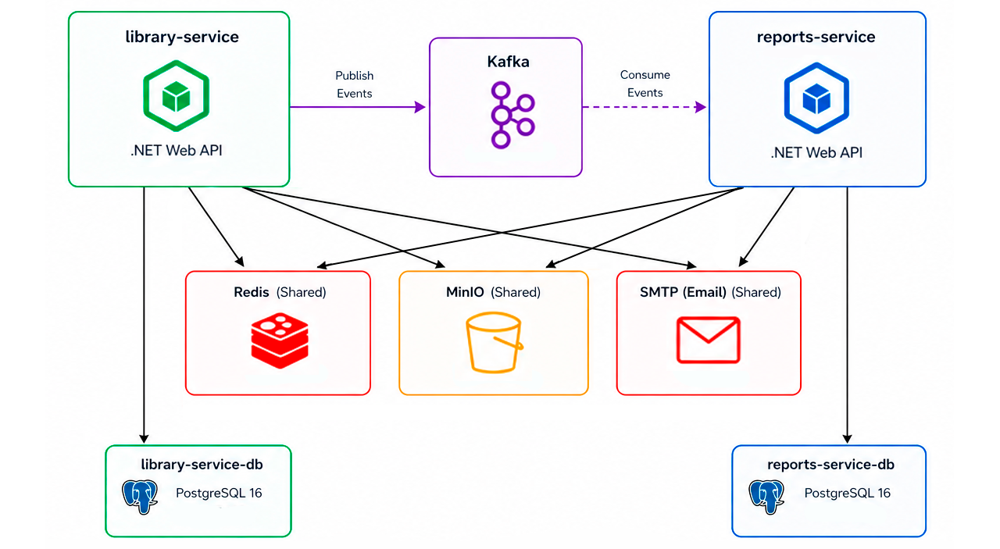
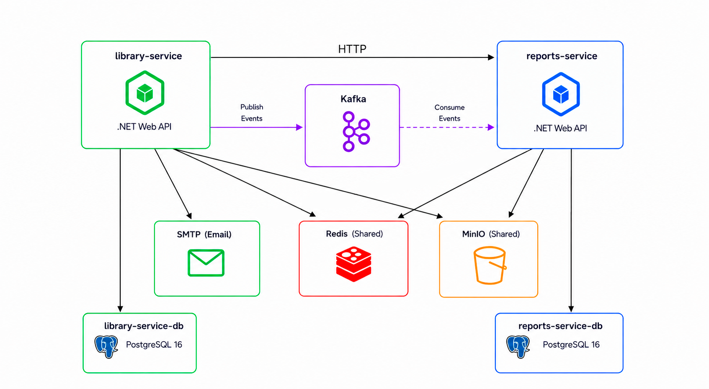
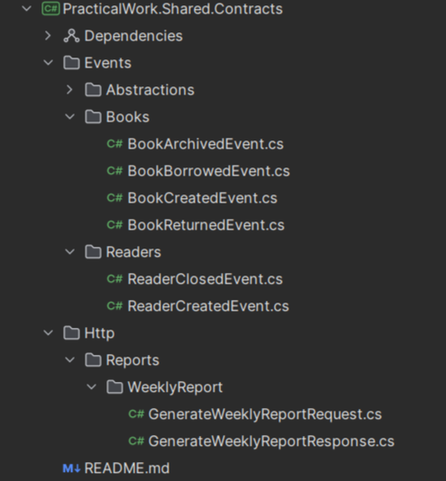
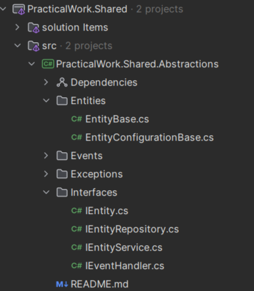
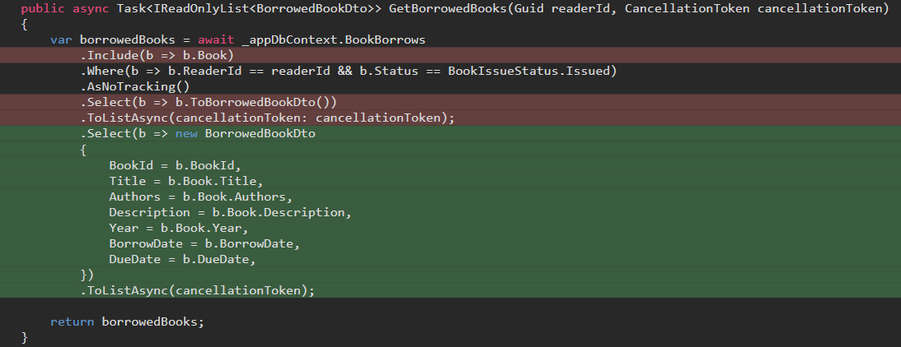
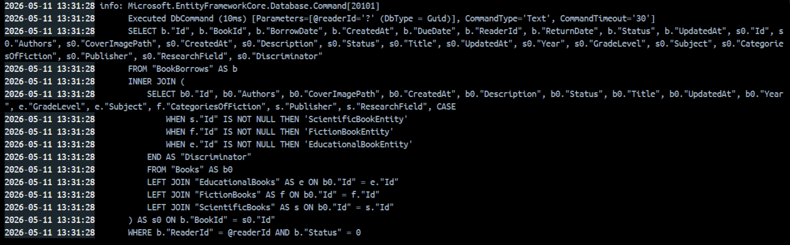
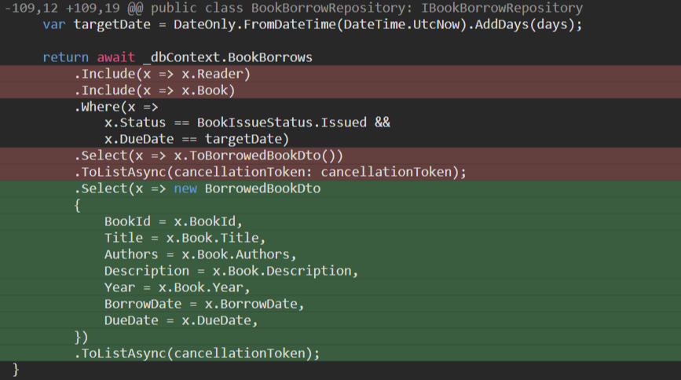
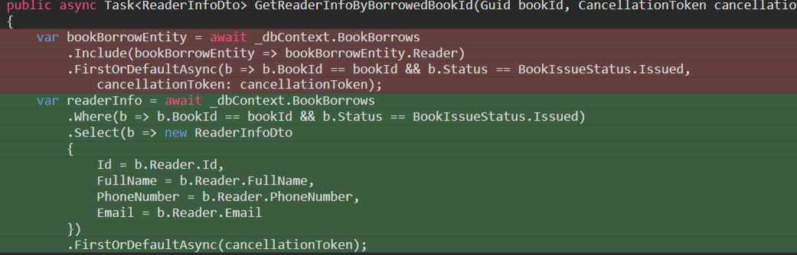
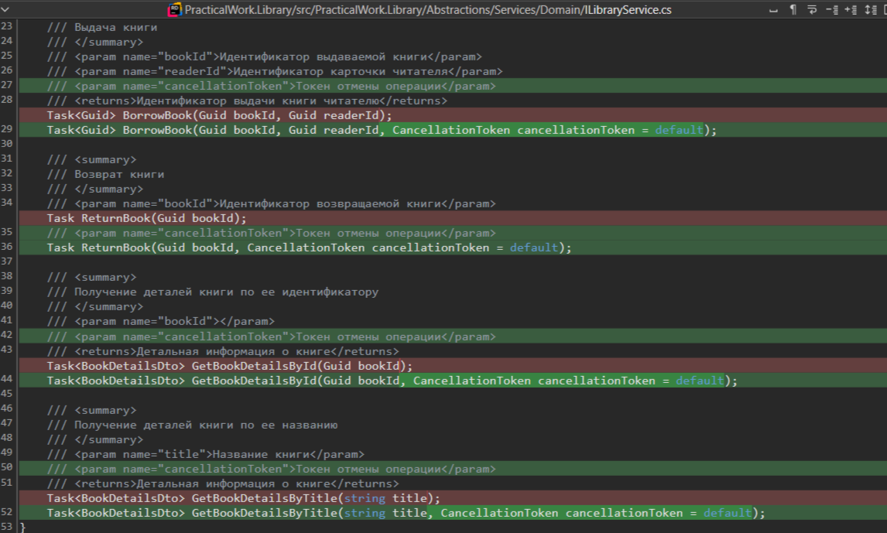
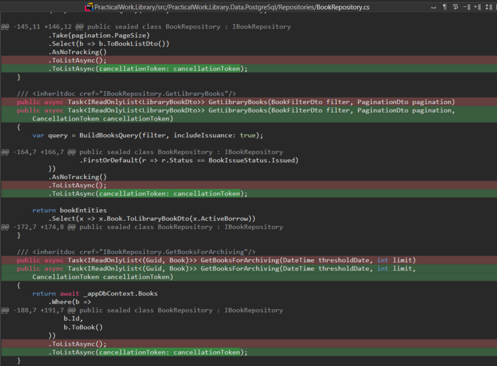

# Перечень выявленных нарушений после анализа архитектуры исходного кода 

## Нарушение принципа единственной ответственности сервиса отчетов

**Проблема:**

Сервис отчетов нарушал принцип единственной ответственности (SRP), поскольку помимо генерации отчетов также содержал бизнес-логику, связанную с управлением еженедельной отчетностью библиотеки: запуск фоновой задачи, сбор статистики и отправку уведомлений администрации.

**Решение:**

Функциональность, относящаяся к доменной области библиотеки, была перенесена в сервис библиотеки:
- фоновая задача формирования еженедельного отчета для администрации;
- логика получения статистики библиотеки;
- отправка электронной почты администрации.

В сервисе отчетов осталась только его основная ответственность — генерация CSV-отчетов.

Теперь процесс выглядит следующим образом: сервис библиотеки собирает статистику и инициирует POST-запрос в сервис отчетов для генерации CSV-файла. Сервис отчетов формирует отчет и возвращает ссылку на его скачивание. Управление фоновой задачей, подготовка данных и отправка уведомлений остаются в сервисе библиотеки, поскольку относятся к его предметной области и зоне ответственности.

**Схема до:**

**Схема после:**

## Дублирование общей логики между сервисамм

**Проблема:**

Сервисы библиотеки и отчетов содержали дублирующуюся общую логику. Например, в каждом сервисе присутствовал проект SharedKernel, включающий одинаковые абстракции. Аналогично, контракты межсервисного взаимодействия (в частности, события Kafka) хранились отдельно в обоих сервисах.

Такой подход приводил к усложнению сопровождения системы: любое изменение общих компонентов требовало синхронного внесения изменений в несколько сервисов, увеличивало вероятность рассинхронизации версий и нарушало принцип переиспользования кода.

**Решение:**

Для устранения дублирования было выделено отдельное решение **PracticalWork.Shared**, представляющее собой репозиторий с исходным кодом общих NuGet-пакетов, используемых в системе PracticalWork.

Оно содержит:
1. **PracticalWork.Shared.Abstractions** - пакет с общими абстракциями
2. **PracticalWork.Shared.Contracts** - пакет с общими контрактами для межсервисного взаимодоействия (асинхронного и синхронного)

В результате общий код больше не дублируется между сервисами, а централизованно поддерживается в отдельном репозитории и распространяется через NuGet-пакеты. Такой подход упрощает сопровождение системы, снижает вероятность ошибок при изменении общих компонентов и позволяет в дальнейшем выносить переиспользуемую функциональность в единое решение без дублирования кода.

**Пример:**

Проект общих контрактов:

Проект общих абстракций:

## Оптимизация EF Core запросов 

**Проблема:**

Запросы к БД с помощью EF Core написаны не оптимально, из-за чего происходит избыточная загрузка данных и ухудшается производительность.

**Решение:**

Вместо загрузки целых сущностей со связями (с помощью Include) был применен подход проекции нужных полей через Select.

**Примеры оптимизации:**

**ДО оптимизации**:

1. EF Core строил SQL-запрос с JOIN между таблицами BookBorrows и Books из-за использования Include(b => b.Book).
2. Из базы данных загружались полные сущности BookBorrowEntity и связанные BookEntity.
3. EF Core материализовал сущности в объекты C# в память.
4. После получения данных в памяти выполнялся метод ToBorrowedBookDto().
5. Mapper преобразовывал entity-объекты в DTO.

**SQL запрос**:

**ПОСЛЕ оптимизации**:

1. В Select сразу описывался BorrowedBookDto.
2. EF Core анализировал projection и генерировал SQL только с нужными колонками для проекции.
3. SQL выполнял необходимый JOIN автоматически.
4. Результат сразу проецировался в DTO без создания entity-объектов в памяти.

**SQL запрос**:

**Результат**:

- Загружаются только нужны данные
- не создаются entity-объекты
- уменьшается потребление памяти
- запрос выполняется быстрее и эффективнее
- убрали лишний маппинг

**Аналогичная оптимизация**

## Отсутствие поддержки отмены асинхронных запросов

**Проблема:**

В асинхронных методах сервисов и репозиториев отсутствовала поддержка отмены операций через **CancellationToken**, что нарушало рекомендации и best practices разработки на ASP.NET Core.

**Решение:**

В параметры асинхронных методов сервисов и репозиториев были добавлены CancellationToken, а также реализована его передача по всей цепочке вызовов — от HTTP-запроса до операций доступа к данным и внешним зависимостям.

**Пример:**

Прокидывание токенов в методы EF Core:

